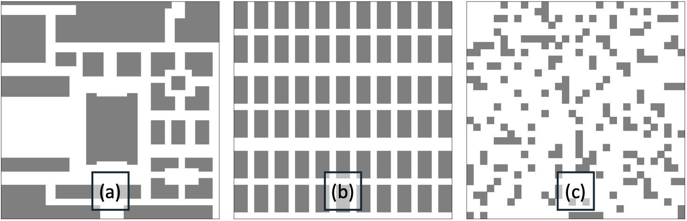
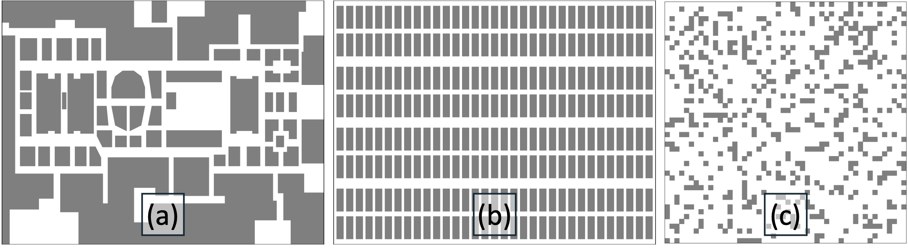
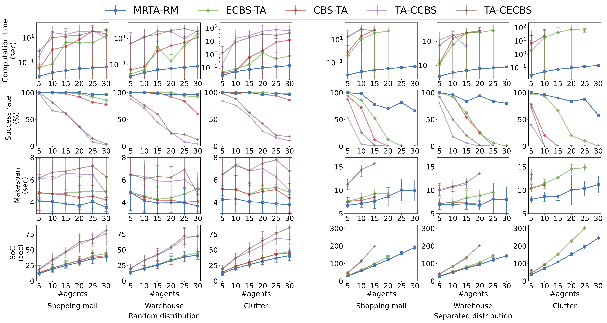
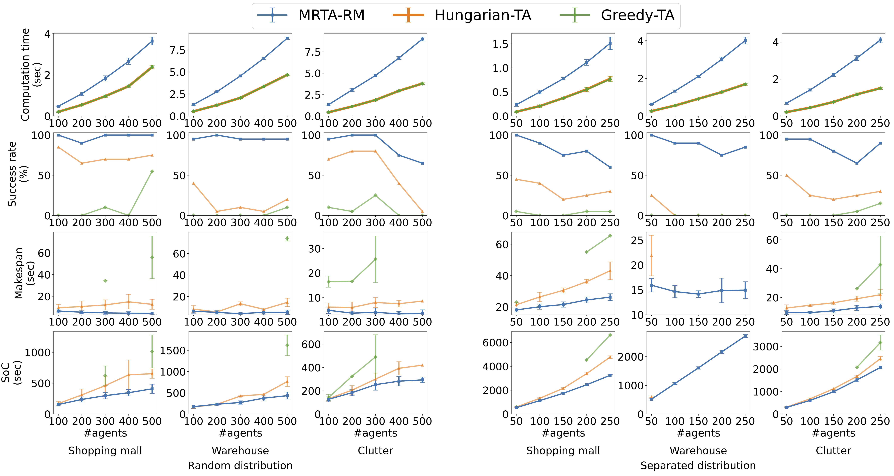

# MRTA-RM — Multi-Robot Task Allocation via Robot Redistribution Mechanism

> 📄 This repository contains the official code for the following paper:

> **Seabin Lee, Joonyeol Sim, and Changjoo Nam**,  
> *"Very Large-scale Multi-Robot Task Allocation in Challenging Environments via Robot Redistribution"*,  
> Robotics and Autonomous Systems (RAS), Dec 2025. 🔗 [View Paper (PDF)](paper/MRTA_RM.pdf) 🎬 [Demo Video](https://youtu.be/tSPjUtrzA-I?si=UIpyX2zHNFKPx2aw)  
> *If you use this code in academic work, please cite the paper above.*

> Visibility-based roadmap + section-level allocation for scalable multi-robot task assignment.  
> Cleanly refactored modules, file-based map I/O (JSON/YAML), and reproducible runs.


## Experiment Preview

<details>
  <summary><strong>Click to expand: Environments & Results (full / mini)</strong></summary>

  <!-- Environments -->
  <h4>Environments</h4>
  <p align="center">
    

  </p>

  <!-- Results -->
  <h4>Results</h4>
  <p align="center">
    

  </p>

</details>

---

## Table of Contents
- [Highlights](#highlights)
- [Project Structure](#project-structure)
- [Installation](#installation)
- [Quickstart](#quickstart)
- [Map Files (JSON/YAML)](#map-files-jsonyaml)
- [Reproducibility](#reproducibility)
- [How It Works (Pipeline)](#how-it-works-pipeline)
- [Configuration Notes](#configuration-notes)
- [Results & Outputs](#results--outputs)
- [Paper](#paper)
- [Contributing](#contributing)
- [License](#license)

---

## Highlights
- **Clear pipeline**: `GVD → Env → Initial allocation → Transfer analysis → Final allocation`
- **File-based maps**: drop `.json` / `.yaml` under `maps/` to define obstacles (`polygons`)
- **Reproducible**: one-line seed setting for fixed robot/goal placements
- **Modular**: each stage is its own module with typed interfaces & docstrings
- **Cleaner internals**: no wildcard imports, safer defaults, dataclass models

---

## Project Structure
```
.
├─ main.py
├─ src/
│  ├─ GVD_generator.py          # Visibility-based roadmap (VBRM)
│  ├─ env_generator.py          # Robot/goal placement, graph augmentation
│  ├─ initial_allocator.py      # InitialAllocator (in-section balance + coarse graph)
│  ├─ transfer_planner.py       # TransferPlanner (section-to-section transfer analysis)
│  └─ final_allocator.py        # FinalAllocator (receive/transfer + final matching)
├─ func/
│  ├─ func.py                   # geometry, path utils, helpers
│  └─ my_class.py               # dataclasses for robots/sections/sets
├─ maps/                        # (optional) JSON/YAML map files
└─ requirements.txt
```

---

## Installation
```bash
# 1) Create & activate a virtual environment (recommended)
python -m venv .venv
# macOS/Linux
source .venv/bin/activate
# Windows
# .venv\Scripts\activate

# 2) Install dependencies
pip install -r requirements.txt
```

> Typical deps: `numpy`, `scipy`, `networkx`, `shapely`, `matplotlib`, `tqdm`, `pyyaml`.

---

## Quickstart
```bash
# (Optional) Put a map file under ./maps
python main.py
```

If your `main.py` exposes CLI flags:
```bash
python main.py --test_set 4 --robots 32 --mapw 200 --maph 200 --robot_size 8
```

---

## Map Files (JSON/YAML)

Place a file in `maps/` named like `4.json`, `4.yaml`, or a friendly alias (e.g., `warehouse_mini.yaml`).  
Both of the following are accepted.

**JSON**
```json
{
  "polygons": [
    [[20,20],[20,60],[60,60],[60,20]],
    [[80,20],[80,60],[120,60],[120,20]]
  ]
}
```

**YAML**
```yaml
polygons:
  - [[0,20],[40,20],[40,100],[0,100]]
  - [[60,20],[100,20],[100,100],[60,100]]
```

- Coordinates can be clockwise or counter-clockwise.  
- First/last point duplication is not required (handled in code).  
- If no file is found, the code falls back to legacy `func.my_map.return_map(test_set)`.

---

## Reproducibility
Fix robot/goal placements generated in `env_generator.py` by seeding NumPy (and optionally `random`) **before** environment creation:
```python
# main.py
import random, numpy as np
random.seed(0)
np.random.seed(0)
```
If supported:
```python
self.env = env(..., seed=0)
```

---

## How It Works (Pipeline)
1. **Roadmap (`VBRM`)** — sample boundaries/obstacles → Voronoi → valid vertices/edges → uniform graph & sections.  
2. **Environment (`env`)** — place robots/goals (collision-aware), connect `R{i}/G{i}` to nearest valid vertices.  
3. **Initial allocation** — balance within sections; build coarse **section graph**; Dijkstra → Hungarian → section sequences.  
4. **Transfer analysis** — count section-to-section flows; classify sections (case1~4); stabilize ordering.  
5. **Final allocation** — receive/transfer robots between sections; stitch per-robot routes; output final pairs.

---

## Configuration Notes
- **Map directory**: default `maps/`; pass `maps_dir` to prefer file-based maps.  
- **Test set**: integer `test_set` selects a map; matching JSON/YAML (e.g., `maps/4.yaml`) is preferred.  
- **Robot size / spacing**: tune `robot_radius`, `node_interval`, sampling distances to control density.  
- **Debug/plots**: check `main.py` flags for saving figures/visualizations.

---

## Results & Outputs
Typical run produces:
- Final **(robot_index, goal_index)** assignments  
- Per-robot **travel waypoints** and **traveled distances**  
- (Optional) figures of roadmap and allocations

---


## Contributing
- Open issues for bugs/features  
- Prefer conventional commits; include minimal repros  
- Run linters/formatters/tests locally before PRs

---

## License
This project is licensed under the **MIT License**.
