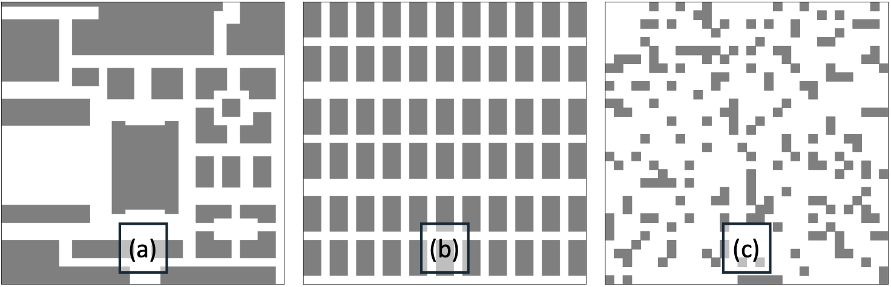
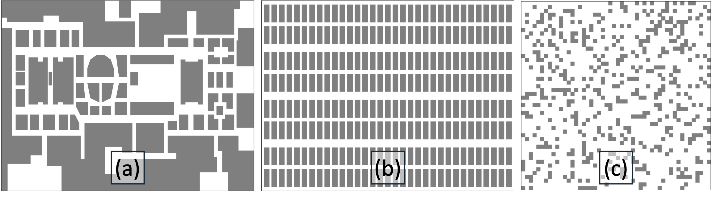
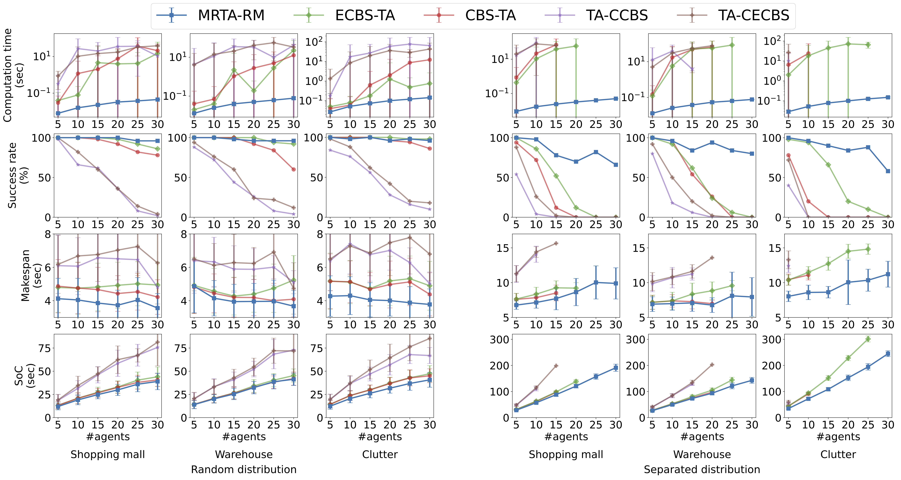
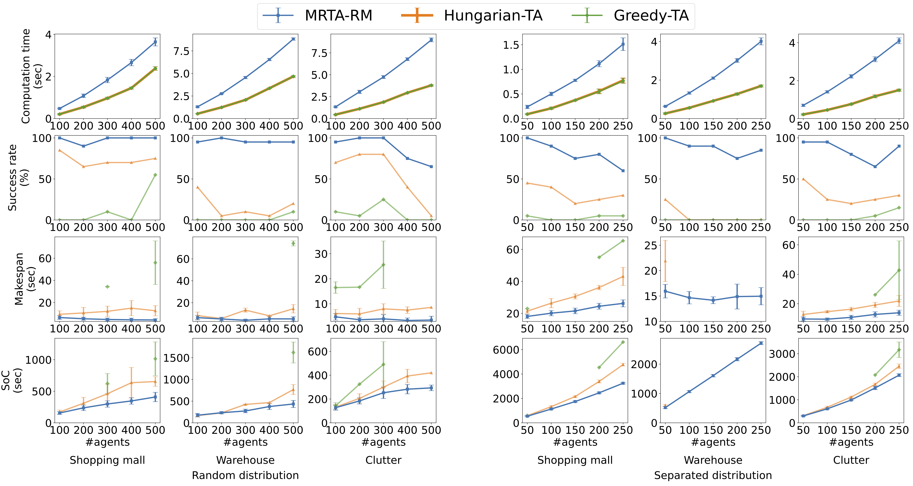

# MRTA-RM: Multi-Robot Task Allocation via Robot Redistribution Mechanism

> **Seabin Lee, Joonyeol Sim, and Changjoo Nam**,
> *"Very Large-scale Multi-Robot Task Allocation in Challenging Environments via Robot Redistribution"*,
> Robotics and Autonomous Systems (RAS), Dec 2025.
> [Paper (PDF)](paper/MRTA_RM.pdf) | [Demo Video](https://youtu.be/tSPjUtrzA-I?si=UIpyX2zHNFKPx2aw)
> *If you use this code in academic work, please cite the paper above.*


Visibility-based roadmap + section-level allocation for scalable multi-robot task assignment.

---

## Experiment Preview

<details>
  <summary><strong>Click to expand: Environments & Results (full / mini)</strong></summary>

  <h4>Environments</h4>
  <p align="center">
    
    
  </p>

  <h4>Results</h4>
  <p align="center">
    
    
  </p>

</details>

---

## Project Structure

```
.
├── main.py                       # Entry point & MRTA_RM class
├── src/
│   ├── GVD_generator.py          # Visibility-based roadmap (VBRM)
│   ├── env_generator.py          # Robot/goal placement & graph augmentation
│   ├── initial_allocator.py      # Section-level balancing + Dijkstra-Hungarian
│   ├── transfer_planner.py       # Section-to-section transfer analysis
│   └── final_allocator.py        # Robot redistribution & final matching
├── func/
│   ├── func.py                   # Geometry & path utilities
│   ├── my_class.py               # Data classes (robots, sections, allocations)
│   └── my_map.py                 # Map loader (reads JSON from maps/)
├── maps/                         # JSON map files (obstacle polygons)
│   ├── demo.json
│   ├── random.json
│   ├── random_mini.json
│   ├── department_store.json
│   ├── department_store_mini.json
│   ├── warehouse.json
│   └── warehouse_mini.json
├── output/                       # Allocation results (auto-generated)
└── requirements.txt
```

---

## Installation

```bash
python -m venv .venv
source .venv/bin/activate        # Windows: .venv\Scripts\activate
pip install -r requirements.txt
```

---

## Quickstart

```bash
python main.py
```

Edit `main.py` to change the map and number of robots:

```python
app = MRTA_RM(test_set=4, robot_num=10)
app.run(show_roadmap=True, show_result=True)
```

---

## Available Maps

| `test_set` | Map name | Size | Max robots |
|------------|----------|------|------------|
| 1 | `random` | 1000 x 1000 | 2000 |
| 2 | `department_store` | 1760 x 900 | 1343 |
| 3 | `warehouse` | 2000 x 880 | 2288 |
| 4 | `demo` | 200 x 200 | 64 |
| 11 | `random_mini` | 640 x 640 | 826 |
| 22 | `department_store_mini` | 640 x 640 | 442 |
| 33 | `warehouse_mini` | 640 x 640 | 496 |

---

## Custom Maps

Place a JSON file in `maps/` with this format:

```json
{
  "map_width": 200,
  "map_height": 200,
  "max_robots": 64,
  "robot_size": 8,
  "polygons": [
    [[20,20],[20,60],[60,60],[60,20]],
    [[80,20],[80,60],[120,60],[120,20]]
  ]
}
```

Then use the filename (without `.json`) as `test_set`:

```python
app = MRTA_RM(test_set="my_custom_map", robot_num=10)
```

---

## Pipeline

1. **Roadmap (VBRM)** -- Sample obstacle boundaries, build Voronoi diagram, extract valid vertices/edges, create uniform graph partitioned into sections.
2. **Environment** -- Place robots/goals randomly (collision-aware), connect each to its nearest valid graph vertex.
3. **Initial allocation** -- Balance within sections; build coarse section graph; Dijkstra + Hungarian to compute section-level transfer sequences.
4. **Transfer analysis** -- Count section-to-section flows; classify sections into 4 cases by transfer/receive patterns.
5. **Final allocation** -- Redistribute robots between sections; produce final (robot, goal) pairs.

---

## Output

Each run saves a JSON file in `output/` containing:
- Final (robot_index, goal_index) allocation pairs
- Per-robot waypoints
- Robot start/goal positions
- Total cost, timing information
- Obstacle polygons

---

## Reproducibility

Fix robot/goal placements by seeding before running:

```python
import random, numpy as np
random.seed(0)
np.random.seed(0)

app = MRTA_RM(test_set=4, robot_num=10)
app.run()
```

---

## License

MIT License
